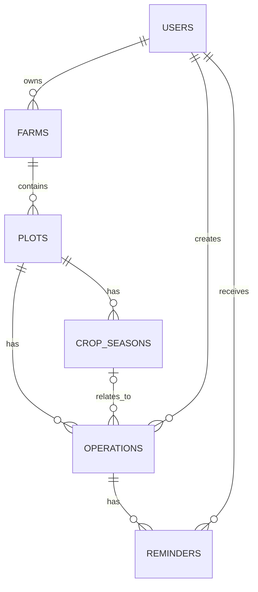

# طراحی MVP سامانهٔ مدیریت مزرعه

## تصمیم‌های فنی

- بک‌اند: **Python 3.12 یا 3.13** و **FastAPI**.
- ORM و اعتبارسنجی مدل‌ها: **SQLAlchemy 2** و **Pydantic 2**.
- Migration: **Alembic**.
- دیتابیس: یک فایل **SQLite** با مسیر قابل تنظیم از متغیر محیطی `DATABASE_URL`.
- احراز هویت: شمارهٔ موبایل و رمز عبور؛ رمز فقط به‌صورت هش امن ذخیره می‌شود.
- API نسخه‌دار و مبتنی بر JSON است؛ فرانت‌اند هیچ دسترسی مستقیمی به فایل SQLite ندارد.

## قواعد عمومی ذخیره‌سازی

- تمام شناسه‌ها UUID نسخهٔ 4 در ستون `TEXT PRIMARY KEY NOT NULL` هستند.
- همهٔ جدول‌ها `created_at` و `updated_at` از نوع `TEXT NOT NULL` دارند. قالب زمان دقیق UTC: `YYYY-MM-DDTHH:MM:SS.ffffffZ`.
- `updated_at` در لایهٔ سرویس، در هر ایجاد یا تغییر رکورد به‌روز می‌شود.
- تاریخ بدون ساعت، `TEXT` با قالب `YYYY-MM-DD` و ساعت محلی، `TEXT` با قالب `HH:MM:SS` است.
- در هر اتصال SQLite، `PRAGMA foreign_keys = ON` فعال می‌شود.
- اعتبارسنجی قالب، منطقهٔ زمانی IANA و منطق تاریخ‌ها در بک‌اند انجام می‌شود.
- حذف داده‌های وابسته به‌شکل آبشاری انجام نمی‌شود؛ در صورت وجود وابستگی، API خطای `409 Conflict` می‌دهد. این انتخاب از حذف ناخواستهٔ سابقه جلوگیری می‌کند.

## جدول‌ها

### `users`

`id`, `full_name`, `phone`, `email`, `password_hash`, `is_active`, `created_at`, `updated_at`

- `phone` اجباری و یکتا است؛ پیش از ذخیره به قالب استاندارد E.164 تبدیل می‌شود.
- `email` اختیاری و یکتا است؛ `NULL` بودن آن مجاز است.
- `is_active INTEGER NOT NULL DEFAULT 1 CHECK (is_active IN (0,1))`.

### `farms`

`id`, `owner_id`, `name`, `province`, `city`, `address`, `latitude`, `longitude`, `timezone`, `description`, `created_at`, `updated_at`

- `owner_id` کلید خارجی اجباری به `users.id` است.
- `timezone TEXT NOT NULL DEFAULT 'Asia/Tehran'` و باید یک منطقهٔ زمانی معتبر IANA باشد.
- عرض جغرافیایی بین `-90` و `90`، طول جغرافیایی بین `-180` و `180` است.
- مختصات یا هر دو `NULL` هستند یا هر دو مقدار دارند.

### `plots`

`id`, `farm_id`, `name`, `code`, `area_m2`, `soil_type`, `description`, `created_at`, `updated_at`

- `farm_id` کلید خارجی اجباری به `farms.id` است.
- `area_m2 REAL NOT NULL CHECK (area_m2 > 0)`.
- نام قطعه در هر مزرعه یکتا است: `UNIQUE(farm_id, name)`.
- کد اختیاری است، اما اگر وجود داشته باشد در همان مزرعه یکتا است: `UNIQUE(farm_id, code)`.

### `crop_seasons`

`id`, `plot_id`, `crop_name`, `variety`, `start_date`, `actual_start_date`, `expected_end_date`, `actual_end_date`, `status`, `notes`, `created_at`, `updated_at`

- `plot_id` کلید خارجی اجباری به `plots.id` است.
- `status TEXT NOT NULL DEFAULT 'planned' CHECK (status IN ('planned','active','completed','cancelled'))`.
- تاریخ پایان برنامه‌ریزی‌شده نباید پیش از شروع برنامه‌ریزی‌شده و تاریخ پایان واقعی نباید پیش از شروع واقعی باشد.
- دوره‌های هم‌پوشان مجازند.

### `operations`

`id`, `plot_id`, `crop_season_id`, `created_by`, `title`, `operation_type`, `description`, `scheduled_date`, `scheduled_time`, `completed_at`, `status`, `result_notes`, `created_at`, `updated_at`

- `plot_id` و `created_by` اجباری‌اند؛ `crop_season_id` اختیاری است.
- `operation_type TEXT NOT NULL CHECK (operation_type IN ('planting','irrigation','fertilizing','spraying','harvesting','other'))`.
- `status TEXT NOT NULL DEFAULT 'planned' CHECK (status IN ('planned','in_progress','completed','cancelled'))`.
- اگر وضعیت `completed` باشد، `completed_at` اجباری است؛ در سایر وضعیت‌ها باید `NULL` باشد.
- اگر `crop_season_id` داده شود، بک‌اند بررسی می‌کند که دورهٔ کشت متعلق به همان `plot_id` باشد.
- زمان `scheduled_date` و `scheduled_time` با منطقهٔ زمانی مزرعه تفسیر می‌شود.

### `reminders`

`id`, `operation_id`, `recipient_id`, `remind_at`, `channel`, `status`, `sent_at`, `read_at`, `attempt_count`, `last_error`, `created_at`, `updated_at`

- `operation_id` و `recipient_id` اجباری‌اند.
- `channel TEXT NOT NULL DEFAULT 'in_app' CHECK (channel = 'in_app')`.
- `status TEXT NOT NULL DEFAULT 'pending' CHECK (status IN ('pending','processing','sent','failed','cancelled'))`.
- `attempt_count INTEGER NOT NULL DEFAULT 0 CHECK (attempt_count >= 0)`.
- هنگام ساخت، بک‌اند بررسی می‌کند که `recipient_id` مالک مزرعهٔ فعالیت باشد.
- `last_error` صرفاً برای ثبت داخلی است و در پاسخ عمومی API برگردانده نمی‌شود.

## روابط

## مالکیت و دسترسی

- هر درخواست احرازشده تنها به داده‌ای دسترسی دارد که مزرعهٔ والد آن متعلق به همان کاربر باشد.
- شناسهٔ کاربر سازندهٔ فعالیت از توکن احراز هویت گرفته می‌شود؛ در بدنهٔ درخواست دریافت نمی‌شود.
- کاربر فقط مزرعه‌های خودش و تمام رکوردهای وابسته به آن‌ها را می‌بیند یا تغییر می‌دهد.

## قرارداد خطای مشترک

- `400`: ورودی یا قانون تجاری نامعتبر.
- `401`: ورود معتبر نیست یا توکن ارسال نشده است.
- `403`: کاربر مالک منبع نیست.
- `404`: منبع در محدودهٔ مجاز کاربر پیدا نشد.
- `409`: تکراری بودن داده یا مانع شدن وابستگی‌ها از حذف.
- `422`: بدنهٔ درخواست با قرارداد API سازگار نیست.

## ابهام‌های بسته‌شده برای MVP

- «حذف» فیزیکی است، اما فقط وقتی هیچ رکورد وابسته‌ای وجود ندارد؛ soft delete اضافه نمی‌کنیم.
- نام قطعه در هر مزرعه یکتا در نظر گرفته شد تا انتخاب قطعه در رابط کاربری ابهام نداشته باشد.
- وضعیت و تاریخ‌های دورهٔ کشت در این گام فقط اعتبارسنجی می‌شوند؛ تغییر خودکار وضعیت از روی تاریخ انجام نمی‌شود.

با این تصمیم‌ها، طراحی گام ۱ کامل است و می‌توان به گام ۲ رفت.
